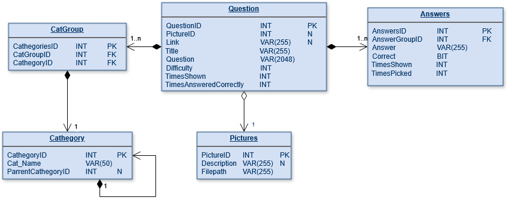

# Aplikace Kvíz (QuizApp)

# Popis

Aplikace s menu pro snadnější orientaci mezi jejími funkcemi. jádro hry umožňuje zobrazit otázky vybrané podle kritérií na které je omezený čas. Hra obsahuje jiné funkce, které rozšiřují její funkčnost.

**Popis funkcí**

Menu:

*   Začít hru
* Přidat Otázku
* Zobrazit statistiky

po kliknutí se otevře okno pro výběr kritérií podle kterých se budou vybírat otázky a jejich počet. 
Tyto kritéria jsou:

* Kategorie otázek
* Počet otázek
* Obtížnost otázek

Okno pro zobrazování otázek vybere vždy 4 možné odpovědi (právě a jen jedna je správná) a zobrazí společně s ostatními informacemi o otázce na kterou je 60 sekund na odpověď (v okně je zobrazeno počítadlo času).
Po výběru odpovědi jsou zobrazeny dodatečné informace ke správné odpovědi (URL link s informacemi o odpovědi). Také pokud byl k otázce přidáno v databázi(volitelné) - zobrazí se tlačítko, které může zobrazit obrázek týkající se dodatečné informace k odpovědi.
Po výběru každé odpovědi se volby ukládají do databáze za účelem sběru a zobrazení statistik.

Aplikace pracuje s daty uvnitř lokální databáze (MSSQL .mdf přiřazen):
 

### Poznámky

- Vzhled a rozložení komponent ve formulářích jsem úplně zanedbal(šlo mi pouze o funkcionalitu). 

### TODO

    - Přidat mnohem více Otázek (aktuálně funguje jen Lehká obtížnost protože v ostatních obtížnostech nejsou data v databázi).
    - ~~Opravit náhodný výběr odpovědí(aktuálně vybere náhodné odpovědi ale pokaždé stejné (jako by se generátor náhodných číšel pro výběr opakoval).~~
    - Vytvořit dvouvrstvou stromovitou strukturu pro vytvoření subkategorii pro další rozdělení otázek.